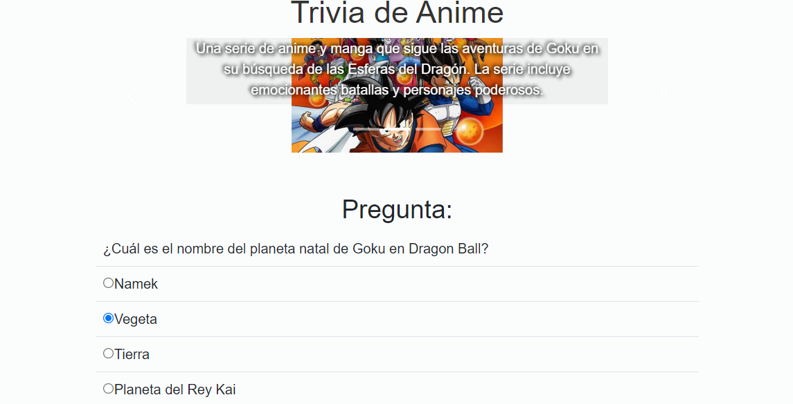

# Juego de Trivia de Anime

Este proyecto es un juego de trivia interactivo que pone en práctica habilidades de desarrollo web utilizando JavaScript, HTML, CSS y Bootstrap. El juego ofrece a los jugadores la oportunidad de poner a prueba sus conocimientos sobre sus animes favoritos y ganar puntos a medida que avanzan.

## Características clave

- **Selección de Anime:** El juego presenta un carrusel con imágenes de diferentes animes, incluyendo "One Piece", "Dragon Ball" y "Naruto". Los jugadores pueden elegir su anime favorito haciendo clic en la imagen correspondiente.

- **Preguntas Interactivas:** Una vez que se selecciona un anime, el juego muestra una serie de preguntas relacionadas con ese anime. Las preguntas son cargadas dinámicamente desde un archivo JSON.

- **Seguimiento de Puntuación:** Los jugadores ganan puntos por cada respuesta correcta y pueden ver su puntuación actual en la parte inferior de la pantalla.

- **Reinicio del Juego:** Después de completar todas las preguntas de un anime, los jugadores pueden reiniciar el juego y seleccionar otro anime para jugar nuevamente.

## Uso de Tecnologías

Este proyecto utiliza una variedad de tecnologías web:

- **JavaScript:** El núcleo del juego se basa en JavaScript para cargar preguntas, verificar respuestas y llevar un registro de la puntuación.

- **HTML y CSS:** La estructura y el diseño de la interfaz de usuario se crean utilizando HTML y CSS, incluyendo el uso de Bootstrap para la maquetación y estilos.

## Cómo jugar

1. Abre el juego y selecciona tu anime favorito haciendo clic en la imagen del carrusel.

2. Responde las preguntas de la trivia seleccionando una de las opciones disponibles.

3. Después de cada pregunta, el juego te informará si tu respuesta es correcta o incorrecta y te mostrará tu puntuación actual.

4. Continúa respondiendo preguntas hasta completar todas las preguntas del anime seleccionado.

5. Una vez completado, puedes reiniciar el juego para seleccionar otro anime y jugar de nuevo.

## Próximos Pasos

Este juego de trivia de anime es solo el comienzo. Puedes expandir y mejorar el proyecto agregando más animes, preguntas y características interactivas. También puedes ajustar el diseño y los estilos para personalizar aún más la experiencia del juego.

¡Diviértete jugando y mejorando tus habilidades de desarrollo web!

---

**Nota:** Este proyecto se creó como parte de un ejercicio de autoaprendizaje y se utiliza con fines educativos y de demostración de habilidades. Los nombres de los animes y las imágenes utilizadas son marcas registradas de sus respectivos propietarios y se utilizan aquí con fines ilustrativos.
